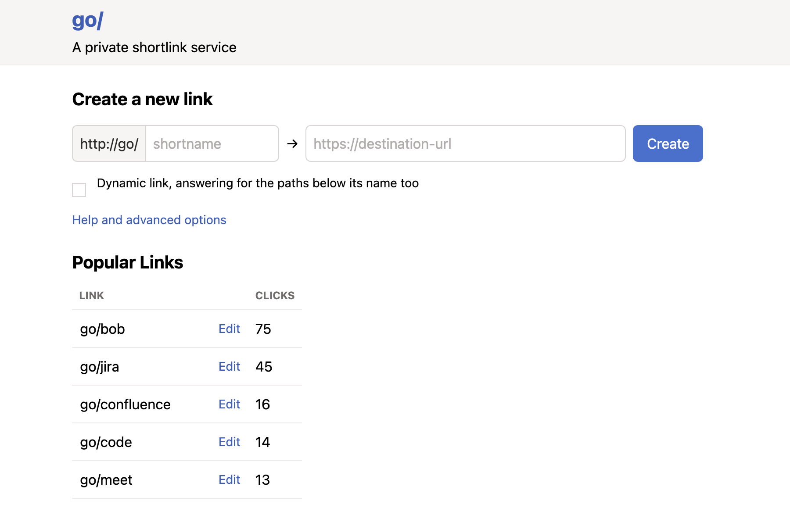

# golink

golink is a private shortlink service for your [tailnet].
It lets you create short, memorable links for the websites you and your team use most.
If you're new to golink, learn more in our [announcement blog post](https://tailscale.com/blog/golink/).
If you were looking for a SaaS go link service that doesn't use Tailscale,
you might be thinking of [golinks.io](https://golinks.io) or [trot.to](http://trot.to)

[tailnet]: https://tailscale.com/kb/1136/tailnet/



## How Tailscale uses golink

We use golink at Tailscale every day by every part of the company.
It is easily one of the most used services on our corporate tailnet.
We even had to change our new hire onboarding to have employees join our tailnet sooner,
since much of the rest of our onboarding involved visiting various go links.

Our production environment is pretty plain; we just run it on a pretty vanilla EC2 VM.
We [back up](#backups) all of our go links once a week from a GitHub Action that stores the snapshot in our internal git monorepo.
That repo has a wrapper script around `golink --resolve-from-backup` so that anyone with a local copy of the repo can always resolve go links offline.

## Building and running

To build from source and run in dev mode:

    go run ./cmd/golink -dev-listen :8080

golink will be available at http://localhost:8080/,
storing links in a temporary database, and will not attempt to join a tailnet.

The equivalent using the pre-built docker image:

    docker run -it --rm -p 8080:8080 ghcr.io/tailscale/golink:main -dev-listen :8080

If you receive the docker error `unable to open database file: out of memory (14)`,
use a persistent volume as documented in [Running in production](#running-in-production).

### Updating Dependencies

After updating dependencies and making changes to `go.mod` and `go.sum`, `flake.nix` needs
to be updated to reflect the new SHA256 of the go dependencies. This can be done by running:

```bash
./update-flake.sh
```

## Joining a tailnet

Create an [auth key] for your tailnet at <https://login.tailscale.com/admin/settings/keys>.
Configure the auth key to your preferences, but at a minimum we generally recommend:

 - add a [tag] (maybe something like `tag:golink`) to make it easier to set ACLs for controlling access and to ensure the node doesn't expires.
 - don't set "ephemeral" so the node isn't removed if it goes offline

Once you have a key, set it as the `TS_AUTHKEY` environment variable when starting golink.
You will also need to specify your sqlite database file:

    TS_AUTHKEY="tskey-auth-<key>" go run ./cmd/golink -sqlitedb golink.db

golink stores its tailscale data files in a `tsnet-golink` directory inside [os.UserConfigDir].
As long as this is on a persistent volume, the auth key only needs to be provided on first run.

[auth key]: https://tailscale.com/kb/1085/auth-keys/
[tag]: https://tailscale.com/kb/1068/acl-tags/
[os.UserConfigDir]: https://pkg.go.dev/os#UserConfigDir

## Registering as a Tailscale Service

By default, golink registers as a regular tailnet node. However, you can register it as a [Tailscale Service],
which provides more stable identity and is especially useful for ephemeral infrastructure (like fly.io)
where storage may be lost.

To register as a service:

```bash
TS_AUTHKEY="tskey-auth-<key>" go run ./cmd/golink -sqlitedb golink.db --register-as-service=svc:golink
```

Or using the environment variable:

```bash
TS_SERVICE_NAME="svc:golink" TS_AUTHKEY="tskey-auth-<key>" go run ./cmd/golink -sqlitedb golink.db
```

**Requirements:**
- The node must be tagged (e.g., `tag:golink`)
- Your ACL policy must define the service and include auto-approvers
- Services only support HTTPS on port 443

**Admin Capabilities in Service Mode:**

Admin capability grants work in service mode by looking up the user's capabilities via the Tailscale daemon whois API. This means admin permissions are properly enforced based on your ACL policy, just like in regular mode.

Example ACL configuration:

```json
{
  "tagOwners": {
    "tag:golink": ["autogroup:admin"]
  },
  "autoApprovers": {
    "services": {
      "svc:golink": ["tag:golink"]
    }
  }
}
```

[Tailscale Service]: https://tailscale.com/kb/1534/services/

## Docker Compose

To run golink via Docker Compose:

```yaml
volumes:
  data:

services:
  golink:
    image: ghcr.io/tailscale/golink:main
    container_name: golink
    restart: unless-stopped
    volumes:
      - 'data:/home/nonroot'
```

To initialize the container with an auth key run:

    docker compose run --rm --env 'TS_AUTHKEY=tskey-auth-<key>' golink

The `compose.yaml` in this repository is a different thing: it is the local
development stack for running golink behind an authenticating proxy, where nginx
stands in for one and authenticates nobody. Start it with `./start-dev.sh`, and
see the comments in that file and in `deploy/nginx/`. `./start-prod.sh` runs the
same arrangement with a real oauth2-proxy in front of it.

## MagicDNS

When golink joins your tailnet, it will attempt to use "go" as its node name,
and will be available at http://go.tailnet0000.ts.net/ (or whatever your tailnet name is).
To make it accessible simply as http://go/, enable [MagicDNS] for your tailnet.
With MagicDNS enabled, no special configuration or browser extensions are needed on client devices.
Users just need to have Tailscale installed and connected to the tailnet.

[MagicDNS]: https://tailscale.com/kb/1081/magicdns/

## Running in production

golink compiles as a single static binary (including the frontend) and can be deployed and run like any other binary.
Two pieces of data should be on persistent volumes:

 - tailscale data files in the `tsnet-golink` directory inside [os.UserConfigDir]
 - the sqlite database file where links are stored

In the docker image, both are stored in `/home/nonroot`, so you can mount a persistent volume:

    docker run -v /persistent/data:/home/nonroot ghcr.io/tailscale/golink:main

The mounted directory will need to be writable by the nonroot user (uid: 65532, gid: 65532),
for example by calling `sudo chown 65532 /persistent/data`.
Alternatively, you can run golink as root using `docker run -u root`.

No ports need to be exposed, whether running as a binary or in docker.
golink will listen on port 80 on the tailscale interface, so can be accessed at http://go/.

<details>
  <summary>Deploy on Fly</summary>

  See <https://fly.io/docs/> for full instructions for deploying apps on Fly, but this should give you a good start.
  Replace `FLY_APP_NAME` and `FLY_VOLUME_NAME` with your app and volume names.

  Create a [fly.toml](https://fly.io/docs/reference/configuration/) file:

  ``` toml
app = "FLY_APP_NAME"

[build]
image = "ghcr.io/tailscale/golink:main"

[deploy]
strategy = "immediate"

[mounts]
source="FLY_VOLUME_NAME"
destination="/home/nonroot"
```

  Then run the commands with the [flyctl CLI].

  ``` sh
  $ flyctl apps create FLY_APP_NAME
  $ flyctl volumes create FLY_VOLUME_NAME
  $ flyctl secrets set TS_AUTHKEY=tskey-auth-<key>
  $ flyctl deploy
  ```

[flyctl CLI]: https://fly.io/docs/hands-on/install-flyctl/

</details>

<details>
  <summary>Deploy on Modal</summary>

  See the [Modal docs](https://modal.com/docs/guide/managing-deployments) for full instructions on long-lived deployments.

  Create a `golinks.py` file:

  ```python
import subprocess

import modal

app = modal.App(name="golinks")

vol = modal.Volume.from_name("golinks-data", create_if_missing=True)

image = modal.Image.from_registry(
    "golang:1.23.0-bookworm",
    add_python="3.10",
).run_commands(["go install -v github.com/tailscale/golink/cmd/golink@latest"])

@app.cls(
    image=image,
    secrets=[modal.Secret.from_name("golinks")],
    volumes={"/root/.config": vol},
    keep_warm=1,
    concurrency_limit=1,
)
class Golinks:
    @modal.enter()
    def start_golinks(self):
        subprocess.Popen(
            [
                "golink",
                "-verbose",
                "--sqlitedb",
                "/root/.config/golink.db",
            ]
        )
```

  Then create your secret and deploy with the [Modal CLI](https://github.com/modal-labs/modal-client):

  ```sh
$ modal secret create golinks TS_AUTHKEY=<key>
$ modal deploy golinks.py
  ```

</details>

<details>
  <summary>Deploy on Kubernetes</summary>

  There is an helm chart provided [here](https://github.com/tiesmaster/golink-helm-chart)
  that can be used to deploy golink to Kubernetes.
  See the `README.md` for [full instructions](https://github.com/tiesmaster/golink-helm-chart#installing-the-chart),
  and [helm values](https://github.com/tiesmaster/golink-helm-chart?tab=readme-ov-file#values).
  But in a nutshell, you can deploy to Kubernetes like this:

  ```sh
  helm install golink oci://ghcr.io/tiesmaster/golink
  ```

</details>

## Running behind an authenticating proxy

golink normally identifies users by their tailnet identity. If instead you run it
behind a proxy that authenticates users itself, such as [oauth2-proxy], name the
header that proxy sets and golink will take the user's identity from it:

    golink -dev-listen :8080 -sqlitedb /home/nonroot/golink.db         -auth-email-header X-Auth-Request-Email         -auth-groups-header X-Auth-Request-Groups

`-auth-groups-header` is optional, and names a header holding the user's groups
as a comma-separated list. The groups are matched against the `Admins` table
described below; they confer nothing on their own.

> [!WARNING]
> golink cannot tell a header set by your proxy from one set by whoever made the
> request. Anything that can reach golink directly can therefore claim to be any
> user, including an admin. Before using this, make sure that
>
>  - nothing but the proxy can open a connection to golink, enforced by the
>    network rather than by convention -- a `NetworkPolicy`, a firewall, or by
>    listening only on a loopback or unix socket the proxy shares; and
>  - the proxy *sets* both headers on every request it forwards, rather than
>    passing through headers it received.
>
> A request that arrives without the email header is refused, so a
> misconfiguration fails closed rather than serving an anonymous user, unless
> you have also passed `-allow-unknown-users`.

[oauth2-proxy]: https://github.com/oauth2-proxy/oauth2-proxy

## Configuration file

Every option can be given in a file instead of on the command line:

    golink -config /etc/golink/golink.hujson

The file names the same options `-help` lists, and is
[hujson](https://github.com/tailscale/hujson) — JSON, with comments and trailing commas
allowed:

```hujson
{
    // Anyone may edit any link that is not locked.
    "open-links": true,
    "sqlitedb": "/home/nonroot/golink.db",
}
```

An option given on the command line wins over the file, so a file of settled defaults
and a one-off override work together. An option name the file gets wrong is an error at
startup rather than something quietly ignored. `deploy/golink.hujson` is a worked
example.

## Restricting the export

`-admin-only-export` lets only an admin fetch `/.export`, which is every link in one
request. The pages stop offering that URL, and the stats and metrics URLs, to anyone
who is not an admin.

`/.export-stats` and `/.metrics` keep answering everybody either way: a metrics scraper
holds no session, so refusing it would break the scrape rather than protect anything.
Not listing them on the help page is about not advertising a diagnostic, and is no
substitute for keeping them behind whatever authenticates the rest of the service.

## Audit webhook

`-webhook-url` posts every create, update and delete of a link. With
`-webhook-format slack`, the default, the body is a message a
[Slack incoming webhook](https://api.slack.com/messaging/webhooks) renders; with
`json` it is the audit event itself, the same object the log line carries.

The URL is a credential, so prefer to give it in a configuration file rather than on
the command line, where the process list would show it. Nothing golink logs about a
webhook failure names the URL.

Posting happens on its own goroutine: saving a link never waits on the webhook and
never fails because the webhook did. If the webhook cannot keep up, events are dropped
with a line in the log rather than queued without bound.

## Permissions

By default, users own the links they create and only they can update or delete those links.
Ownership can be transferred to another user from the link edit page.
Links whose owner is no longer part of the tailnet can be edited by any user,
at which point that user will become the new owner.

Start golink with `-open-links` to invert that default: any user can then update
or delete any link, and editing a link no longer changes who owns it.
A link's owner (or an admin) can *lock* the link from its detail page, which
restores the default behavior for that link alone -- only its owner and admins
can update, delete, or unlock it. The lock checkbox is only shown, and only has
any effect, when running with `-open-links`.

Users can be granted admin access to edit all links using [ACL grants] in your tailnet policy file.
For example, if you have your golink instance tagged with `tag:golink` and a user group named `group:golink-admins`,
you can grant them admin access using:

```json
{
  "grants": [{
      "src": ["group:golink-admins"],
      "dst": ["tag:golink"],
      "app": {
        "tailscale.com/cap/golink": [{
            "admin": true
        }]
      }
  }]
}
```

Or if you want to effectively disable the ownership model and allow everyone in your tailnet to edit all links,
you could assign the grant to `autogroup:member`:

```json
{
  "grants": [{
      "src": ["autogroup:member"],
      "dst": ["tag:golink"],
      "app": {
        "tailscale.com/cap/golink": [{
            "admin": true
        }]
      }
  }]
}
```

[ACL grants]: https://tailscale.com/kb/1324/acl-grants

Admins can also be listed in the `Admins` table of the SQLite database, which is
useful when the tailnet policy file is not where you want to manage them.
golink only ever reads that table; add and remove admins with `sqlite3`:

```sh
sqlite3 golink.db "INSERT INTO Admins (Name) VALUES ('amelie@example.com');"
sqlite3 golink.db "INSERT INTO Admins (Name) VALUES ('group:eng@example.com');"
sqlite3 golink.db "SELECT Name FROM Admins;"
sqlite3 golink.db "DELETE FROM Admins WHERE Name = 'amelie@example.com';"
```

A row names either a user, by login, or a group the user belongs to, written
with a `group:` prefix as in a tailnet ACL. A group row only ever matches if
golink's identity source reports group membership; the tailnet identity it uses
by default reports none, so group rows are for deployments that authenticate
users some other way.

Names are matched case-insensitively, and each request consults the table, so
changes take effect immediately without restarting golink. Anyone listed there
is an admin in addition to anyone granted admin by an ACL grant; an empty table
grants nothing. Note that the table is not part of a `/.export` snapshot, so
back it up separately.

## Storing links in MySQL

Links are kept in a SQLite file by default. `-mysql` puts them in MySQL instead,
which is what lets more than one instance serve the same links:

    GOLINK_MYSQL_DSN='golink:password@tcp(mysql:3306)/golink' golink -dev-listen :8080

The DSN is the [go-sql-driver] form, `user:password@tcp(host:3306)/database`. It is
a credential, so give it in the environment or the configuration file (as `"mysql"`)
rather than on the command line. Giving both `-mysql` and `-sqlitedb` is an error at
startup rather than a guess about which you meant.

golink creates the tables it needs on every start, from `schema-mysql.sql`, and never
alters a table that already exists. **MySQL 8.0.13 or newer** is needed for the
timestamp defaults, and 8.0.16 for the constraint on the `Admins` table; both are only
reached by a row you insert yourself.

Everything else behaves the same, including `/.export`, which is still the portable
backup and the only thing that carries links from one backend to the other. Admins are
listed the same way, with the `mysql` client instead of `sqlite3`:

    mysql golink -e "INSERT INTO Admins (Name) VALUES ('you@example.com');"

Connections are capped at 8, retired after three minutes, and given connect, read and
write deadlines, so that a database which has stopped answering fails requests instead
of hanging them. A DSN that sets `timeout`, `readTimeout` or `writeTimeout` keeps its
own values.

[go-sql-driver]: https://github.com/go-sql-driver/mysql#dsn-data-source-name

## Running more than one instance

Several golink processes can serve the same links, provided two things are shared.

**The XSRF key.** golink signs the hidden token in its forms, and by default it
invents a key when it starts, so a form rendered by one instance is refused by
another with `invalid XSRF token`. Give every instance the same `-xsrf-key`, at
least 16 characters, and they accept each other's forms:

    GOLINK_XSRF_KEY=... golink ...          # or "xsrf-key" in the config file

It is a credential, so prefer the environment or the configuration file to the
command line, where the process list would show it. A key shorter than 16
characters is refused at startup rather than accepted as a weak one.

**The session, if something authenticates in front.** oauth2-proxy keeps its session
in the cookie rather than on the server, so no sticky sessions or shared cache are
needed -- but every instance of it must be given the same `--cookie-secret`, or a
session minted by one is not readable by the next.

Two other things follow from more than one instance:

 - **The database has to be one they can share.** Two processes cannot use one SQLite
   file: the second to start fails with `database is locked`. Use `-mysql` instead.
 - **Click counts converge rather than being exact.** Each instance counts clicks in
   memory and writes what it has counted every five seconds, then reads the totals
   back, so a link's count includes every instance's clicks within a flush. A
   `SIGINT` or `SIGTERM` flushes once before exiting, so a rolling restart does not
   throw away the last few seconds; a `SIGKILL` does.

## Backups

Once you have golink running, you can back up all of your links in [JSON lines] format from <http://go/.export>.
At Tailscale, we snapshot our links weekly and store them in git.

To restore links, specify the snapshot file on startup.
Only links that don't already exist in the database will be added.

    golink -snapshot links.json

[JSON lines]: https://jsonlines.org/

You can also resolve links locally using a snapshot file:

    golink -resolve-from-backup links.json go/link

## Firefox configuration

If you're using Firefox, you might want to configure two options to make it easy to load links:

  * to prevent `go/` page loads from the address bar being treated as searches,
    navigate to `about:config` and add a boolean setting `browser.fixup.domainwhitelist.go`
    with a value of _true_

  * if you use HTTPS-Only Mode, [add an exception](https://support.mozilla.org/en-US/kb/https-only-prefs#w_add-exceptions-for-http-websites-when-youre-in-https-only-mode)

## HTTPS

When golink joins your tailnet it will check to see if HTTPS is enabled and
begin serving HTTPS traffic it detects that it is. When HTTPS is enabled golink
will redirect all requests received by the HTTP endpoint first to their internal
HTTPS equivalent before redirecting to the external link destination.

**NB:** If you use `curl` to interact with the API of a golink instance with HTTPS
enabled over its HTTP interface you _must_ specify the `-L` flag to follow these
redirects or else your request will terminate early with an empty response. We
recommend the use of the `-L` flag in all deployments regardless of current
HTTPS status to avoid accidental outages should it be enabled in the future.
